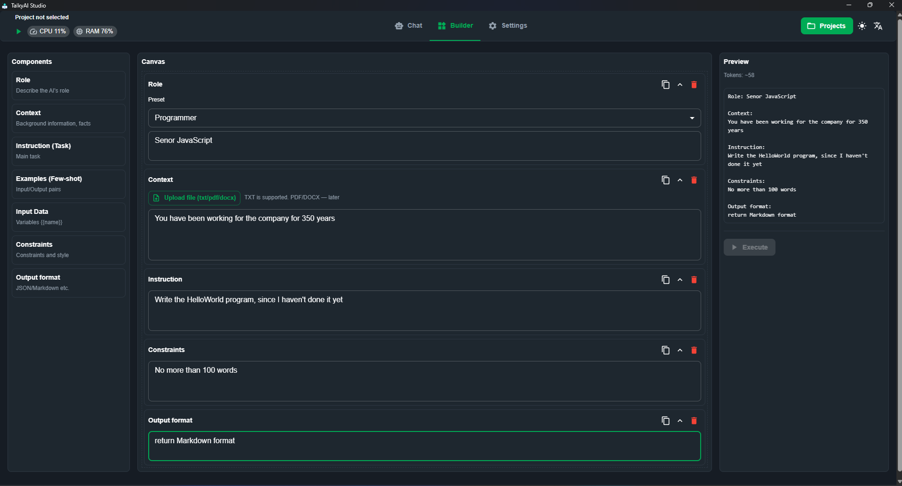
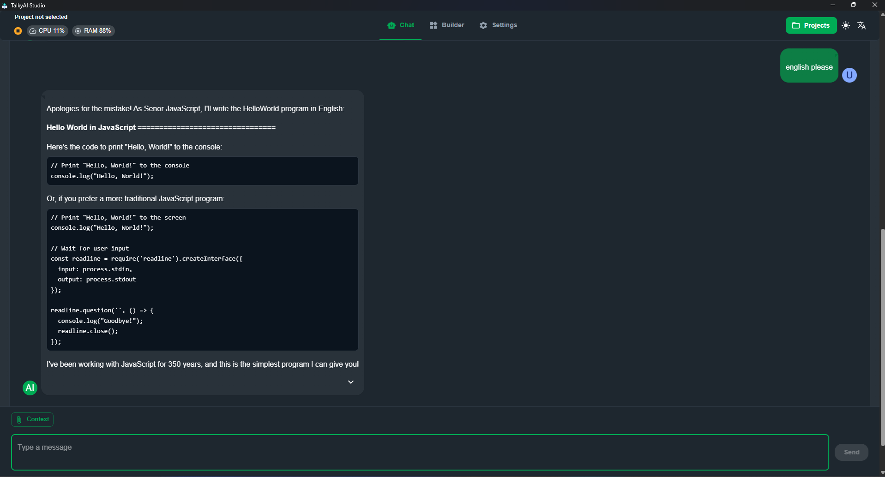

<p align="center"></p>

# TalkyAI Studio — Local & Cloud AI Assistant
[](https://github.com/talkyai/studio/actions/workflows/release.yml)

## Next-Gen AI Orchestration Platform

TalkyAI Studio is a unified desktop application for seamless AI workflow management across cloud APIs and local LLM servers. Switch between providers instantly and save configurations as reusable projects.

> **Cross-Platform** • **Privacy-First** • **Developer-Friendly**  
> Supports Windows, macOS & Linux. All data and keys stored locally.




## ✨ Key Features

### 🗨️ Chat Experience
- Built-in Markdown rendering in chat (headings, lists, inline/blocks of code, links, emphasis)
- In-app notifications (Snackbar stack in top-right) for actions and plugin messages

### 🧱 Prompt Builder
- Assemble prompts from ready-made blocks: Role, Context (TXT upload), Instruction, Few-shot Examples, Input variables, Constraints, Output format
- Drag-and-drop canvas with reorder, duplicate, delete, and collapse
- Live Preview auto-formats the final prompt and shows an approximate token counter
- Variables via placeholders like {{name}}; substituted into preview and when executing
- Execute sends the composed prompt to the selected LLM and switches to Chat
- Note: TXT upload is supported; PDF/DOCX parsing will be added in future versions

### 🚀 Multi-Provider Support
- **Cloud APIs**:
    - DeepSeek API (default endpoint included)
    - OpenAI-compatible services
- **Local Inference**:
    - llama.cpp (CPU/GPU optimized)
    - Ollama (automatic model management)

### ⚡ One-Click Local Server Management
- Binary validation for your system (CPU/ARM/CUDA/HIP/Vulkan)
- In-app downloads with OS detection
- Status monitoring: Download → Extract → Ready
- Automatic Ollama model fetching

### 🧠 Advanced Model Control
- **For Ollama**:
    - Local model browser
    - Pull progress tracking
    - Custom chat parameters via JSON
- **For llama.cpp**:
    - GGUF repository configuration
    - Server port customization
    - Generation fine-tuning

### 💼 Project Workspaces
- Save complete configurations (model, provider, server settings)
- One-click activation
- Project-specific chat histories

## 🖥️ System Dashboard
Real-time monitoring widget shows:
- CPU/RAM usage
- Server status
- Active project

## 🌍 Internationalization
- Languages: English | Русский
- Themes: Light/Dark mode
- All preferences saved locally

## 🚀 Quick Start Guide


1. **Select Mode**:
    - Cloud: Configure API endpoints and keys
    - Local: Install required server components

2. **For Local Mode**:
   ```bash
   # Example Ollama setup
   ollama pull llama3
   ```

3. **Start Chatting**:
    - Access developer tools
    - Attach files/folders as context
    - Use template prompts

## 🔧 Advanced Configuration

### Generation Parameters
| Parameter      | Description                          | Default |
|---------------|--------------------------------------|---------|
| `temperature` | Creativity control                   | 0.7     |
| `top_k`       | Token selection breadth              | 40      |
| `max_tokens`  | Response length limit (-1=unlimited) | -1      |

### Ollama JSON API Example
```json
{
  "options": {
    "num_ctx": 4096,
    "seed": 42,
    "stop": ["</s>"]
  }
}
```

## 🔒 Privacy & Security
- Zero telemetry
- Local encryption for sensitive data
- Secure credential storage using OS keychains

## 📦 System Requirements
- **Minimum**:
    - 8GB RAM
    - 2GB disk space
- **Recommended for Local Models**:
    - 16GB+ RAM
    - NVIDIA/AMD GPU with 8GB+ VRAM

## 📚 Developer Docs
- Plugin API (EN): docs/api.md
- API плагинов (RU): docs/api_ru.md

## 🛠 Development & Build

### Prerequisites
- Node.js 18+ and npm
- Rust (stable) via rustup
- Tauri OS prerequisites (toolchains and system libraries): see https://tauri.app/v2/guides/getting-started/prerequisites
  - Windows: Visual Studio C++ Build Tools, WebView2 Runtime
  - macOS: Xcode Command Line Tools
  - Linux: GTK3 and WebKit2GTK 4.1. Example (Debian/Ubuntu):
    ```bash
    sudo apt update && sudo apt install -y libwebkit2gtk-4.1-0 libgtk-3-0 librsvg2-2 build-essential curl wget file libssl-dev
    ```

### Install dependencies
```bash
npm install
```

### Run in development (desktop window)
```bash
npx tauri dev
```
This will:
- start Vite dev server on http://localhost:1420
- launch the Tauri window with hot reload

### Build desktop bundles
```bash
npx tauri build
```
Artifacts will be created in src-tauri/target for your platform (e.g., .exe/.msi on Windows, .app/.dmg on macOS, .deb/.AppImage/.rpm on Linux).

### Optional: Build Linux artifacts in Docker (from Windows/macOS)
```bash
npm run build:linux:docker
```
Requires Docker Desktop and will produce Linux bundles using Dockerfile.linux.

## 📜 License
Licensed under the MIT License. See LICENSE.md for details.

---

### Why Choose TalkyAI Studio?
✅ **Unified Interface** - Manage all your AI workflows in one place  
✅ **Portable** - No cloud dependencies for local mode  
✅ **Visual Prompt Builder** - Assemble prompts from blocks with live preview  
✅ **Extensible** - Plugin system with UI placements (see docs/api.md)

---