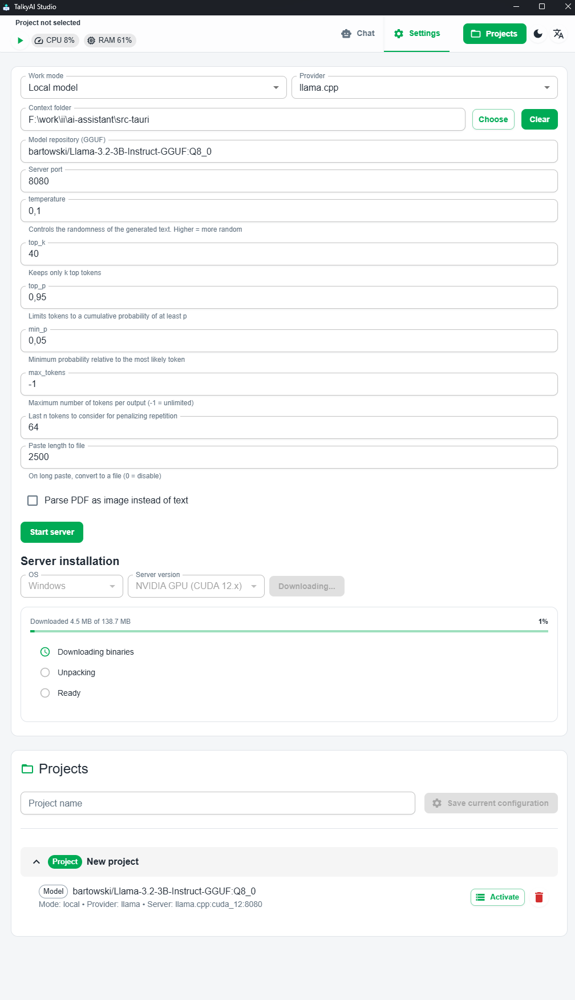
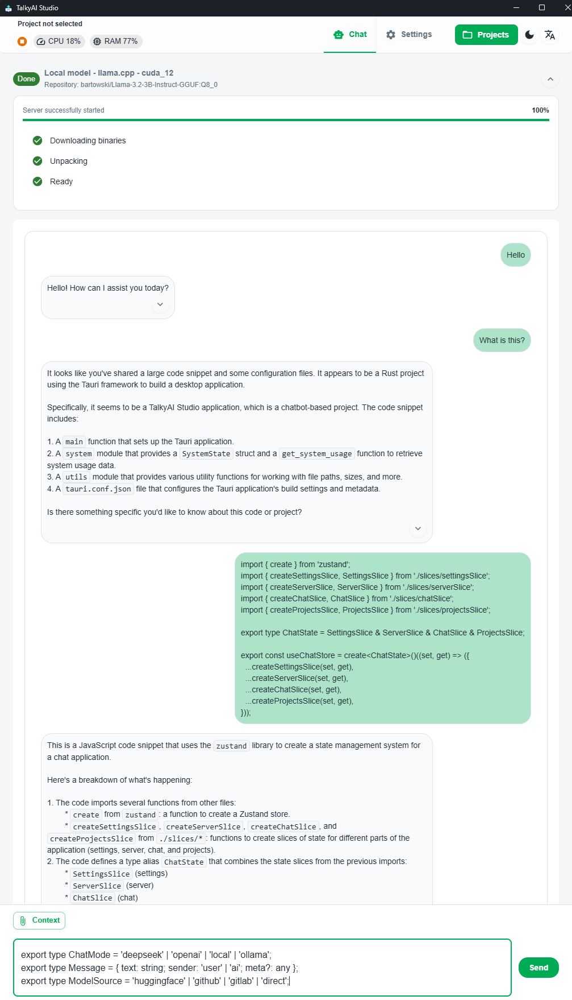
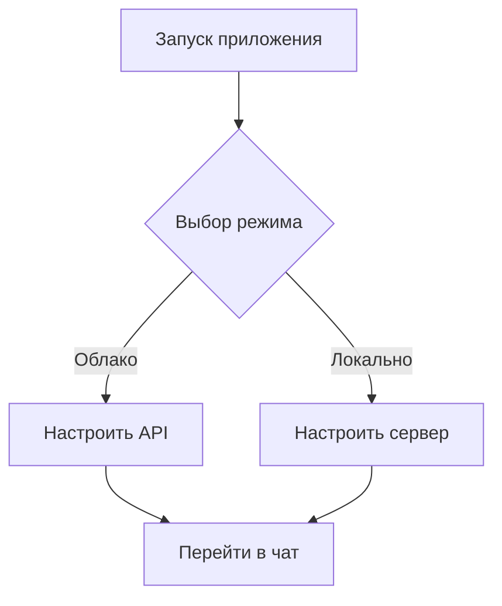

# TalkyAI Studio — локальный и облачный AI‑ассистент

## Платформа следующего поколения для оркестрации ИИ

TalkyAI Studio — это единое настольное приложение для удобного управления рабочими процессами ИИ как через облачные API, так и через локальные LLM‑серверы. Мгновенно переключайтесь между провайдерами и сохраняйте конфигурации в виде переиспользуемых проектов.

> Кроссплатформенно • Конфиденциально • Удобно для разработчиков  
> Поддерживает Windows, macOS и Linux. Все данные и ключи хранятся локально.




## ✨ Ключевые возможности

### 🚀 Поддержка нескольких провайдеров
- Облачные API:
  - DeepSeek API (включена дефолтная конечная точка)
  - Сервисы, совместимые с OpenAI
- Локальные инференс‑серверы:
  - llama.cpp (оптимизации для CPU/GPU)
  - Ollama (автоматическое управление моделями)

### ⚡ Установка и управление локальными серверами в один клик
- Проверка совместимости бинарников с вашей системой (CPU/ARM/CUDA/HIP/Vulkan)
- Загрузка прямо из приложения с определением ОС
- Мониторинг статуса: Загрузка → Распаковка → Готово
- Автозагрузка модели для Ollama

### 🧠 Расширенное управление моделями
- Для Ollama:
  - Локальный браузер моделей
  - Отслеживание прогресса pull
  - Пользовательские параметры чата через JSON
- Для llama.cpp:
  - Настройка GGUF‑репозитория
  - Настройка порта сервера
  - Тонкая настройка генерации

### 💼 Рабочие пространства проектов
- Сохранение целых конфигураций (модель, провайдер, настройки сервера)
- Активация в один клик
- Истории чатов на уровне проектов

## 🖥️ Системная панель
Виджет мониторинга в реальном времени показывает:
- Использование CPU/RAM
- Статус сервера
- Активный проект

## 🌍 Интернационализация
- Языки: English | Русский
- Темы: светлая/тёмная
- Все предпочтения сохраняются локально

## 🚀 Быстрый старт



1. Выберите режим:
   - Облако: укажите конечные точки API и ключи
   - Локально: установите необходимые компоненты сервера

2. Для локального режима:
```bash
# Пример для Ollama
ollama pull llama3
```

3. Начните общение:
   - Используйте инструменты разработчика
   - Прикрепляйте файлы/папки как контекст
   - Применяйте шаблоны подсказок

## 🔧 Дополнительная конфигурация

### Параметры генерации
| Параметр       | Описание                                  | По умолчанию |
|----------------|-------------------------------------------|--------------|
| `temperature`  | Контроль креативности                     | 0.7          |
| `top_k`        | Ширина выбора токенов                     | 40           |
| `max_tokens`   | Лимит длины ответа (−1 = без ограничений) | −1           |

### Пример JSON для Ollama API
```json
{
  "options": {
    "num_ctx": 4096,
    "seed": 42,
    "stop": ["</s>"]
  }
}
```

## 🔒 Конфиденциальность и безопасность
- Нулевая телеметрия
- Локальное шифрование чувствительных данных
- Безопасное хранение ключей через системные хранилища ОС

## 📦 Системные требования
- Минимальные:
  - 8 ГБ RAM
  - 2 ГБ свободного места
- Рекомендуемые для локальных моделей:
  - 16+ ГБ RAM
  - Видеокарта NVIDIA/AMD с 8+ ГБ VRAM

## 📜 Лицензия
В данный момент лицензия не указана — [свяжитесь с нами](mailto:ctapu4ok91@gmail.com) для обсуждения вариантов лицензирования.

---

### Почему именно TalkyAI Studio?
✅ Единый интерфейс — управляйте всеми AI‑процессами в одном месте  
✅ Портативность — локальный режим не зависит от облака  
✅ Расширяемость — система плагинов скоро появится


---
